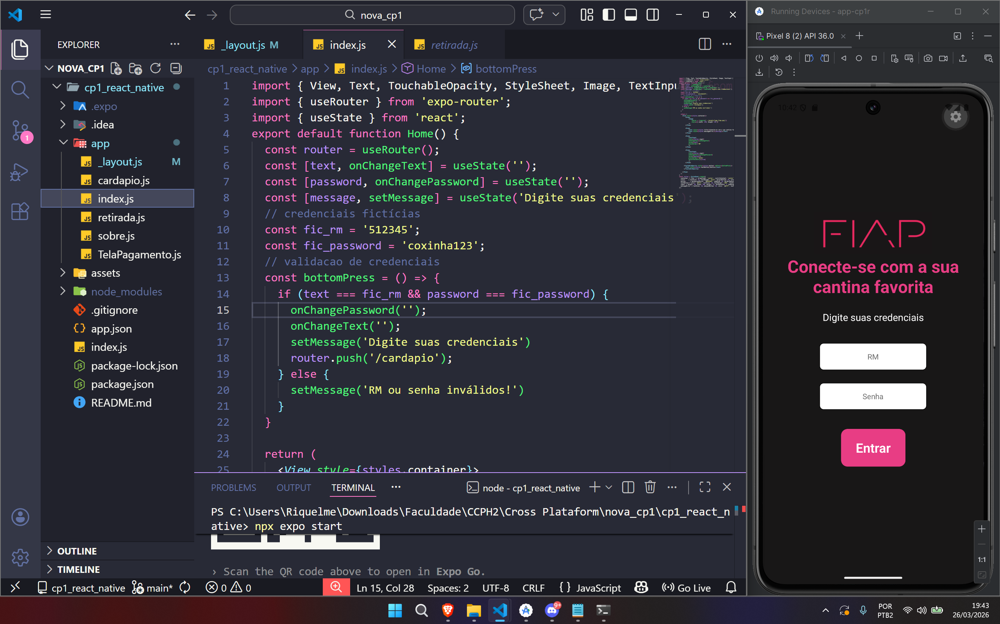
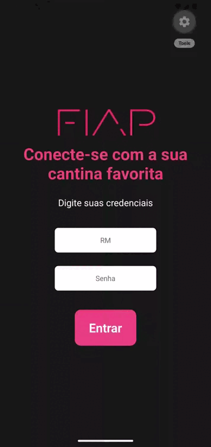
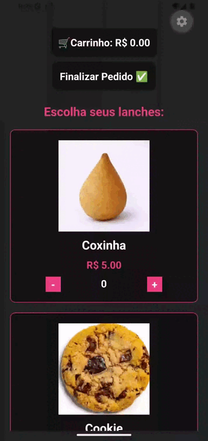

# CP 1 - REACT NATIVE 
### Integrantes
Luiz Henrique Barbosa Dias | RM: 562399  
Riquelme Santos da Mata | RM: 565053  
Gregory  
Nathan  
Rodrigo Kenshin Viana Matayoshi | RM564026

## APP: FIAP CANTEEN 
Os alunos da Faculdade de Informática e Administração Paulista (FIAP) passam por um problema durante os intervalos das aulas: as grandes filas e incertezas na cantina. Esse obstáculo faz com que os estudantes fiquem ainda mais tempo nas filas e, muitas vezes, não possuem tempo o suficiente para comer ou descansar durante o intervalo. 

O aplicativo FIAP CANTEEN é um app MVP e foi criado com o objetivo e reduzir essas filas e incertezas, possibilitando aos estudantes a reserva e pré-pagamento dos lanches antes mesmo de chegar na cantina.

Para logar no aplicativo, é necessário colocar seu RM e senha da plataforma, assim o aplicativo irá exibir os lanches que estão disponíveis para compra na cantina da FIAP. Escolhendo o lanche e colocando as informações do cartão, seu lanche será comprado e um código será exibido para saber qual lanche foi comprado.

## Pré-requisitos
- Node.js : para baixar o Node.js, vá ao site oficial do Node.js, baixe o ambiente de execução Node.js e, após instalar, defina-o como variável de ambiente. 
Link do site: https://nodejs.org/pt-br.  
- EXPO GO: as instruções para configurar o EXPO estão no tópico **Como rodar o projeto**.

-   para baixar EXPO, abra a página do projeto com
```
cd cp1_react_native
```
Após isso, digite o código abaixo no terminal para ignorar conflitos de peer dependency:
```
npm install -g expo-cli
```
Finalmente, instalamos o expo e seus pacotes com o código abaixo:
```
npx expo install expo-router react-native-safe-area-context react-native-screens
```

## Como clonar ou baixar o repositório
Para baixar o projeto, siga as orientações abaixo:
1. Clique no botão verde **code**;
2. Clique em **Download ZIP**;
3. Salve no seu computador.

Você também pode utilizar o comando **git clone** para clonar todo o repositório e ter acesso aos commits feitos durante o projeto. Para isso, basta fazer:
```
git clone https://github.com/r1qk/cp1_react_native.git
```
## Como rodar o projeto 
Para rodar o projeto, abra a pasta que você criou ao baixar o repositório e abra o terminal (pode ser o terminal do computador ou pelo VSCODE). Após fazer isso, digite o código abaixo para abrir a pasta onde as páginas do app estão localizadas.
```
cd cp1_react_native
```
Depois disso, digite o código abaixo no terminal para ignorar conflitos de peer dependency:
```
npm install -g expo-cli
```
Finalmente, instalamos o expo e seus pacotes com o código abaixo:
```
npx expo install expo-router react-native-safe-area-context react-native-screens
```
Agora o código está pronto para ser incializado. Basta digitar o código abaixo no terminal:
```
npx expo start
```
A partir daqui, é possível visualizar o app de duas formas: android studio e app expo no celular.   
Uma delas é pelo android studio, que é configurado pelo EXPO (também é possível abrir o android studio manualmente, mas é necessário baixá-lo). Digite **a** no terminal para abrir o android studio, e o emulador irá começar a rodar.



Também é possível rodar o aplicativo no celular, basta baixar o app do EXPO GO no celular e depois apontar a câmera para o QRCODE gerado pelo EXPO no terminal. 

## Demonstração




## Decisões técnicas
O aplicativo FIAP CANTEEN foi desenvolvido como um MVP (Minimum Viable Product), com foco em demonstrar a proposta de reduzir filas nas cantinas por meio de pedidos antecipados. Por ser um projeto apenas de front-end, as funcionalidades são simuladas, sem integração com backend.

Foi utilizado React Native com Expo para agilizar o desenvolvimento e testes, além do Android Studio como suporte para emulação no Android.

O hook useEffect foi utilizado para gerenciar estados e efeitos colaterais, como a definição e validação de dados do usuário (RM, senha) e exibição de mensagens de erro, simulando o processo de login.

A navegação do aplicativo foi organizada de forma linear e intuitiva, simulando a jornada do usuário dentro do sistema. O fluxo inicia na tela de Login, onde o usuário insere suas credenciais. Após a validação (simulada), o usuário é direcionado para o Menu de Lanches, onde pode visualizar e selecionar produtos. Em seguida, há a tela de Confirmação de Pagamento, que representa a finalização do pedido. Por fim, o usuário é direcionado para uma tela de Sucesso, onde é exibido um código do lanche para retirada, simulando o funcionamento real do sistema.

## O que o grupo faria se tivesse mais tempo
Se houvesse mais tempo para evolução do projeto, seriam implementadas novas funcionalidades para torná-lo mais completo e próximo de um produto real. Entre elas, a criação de uma tela de perfil do usuário, permitindo o gerenciamento de dados pessoais e histórico de pedidos; a integração com um backend, possibilitando autenticação real e armazenamento de informações dos usuários; e a adição de uma funcionalidade para escolha da cantina de retirada (como quinto ou sétimo andar), oferecendo maior flexibilidade e melhorando ainda mais a experiência do usuário.
