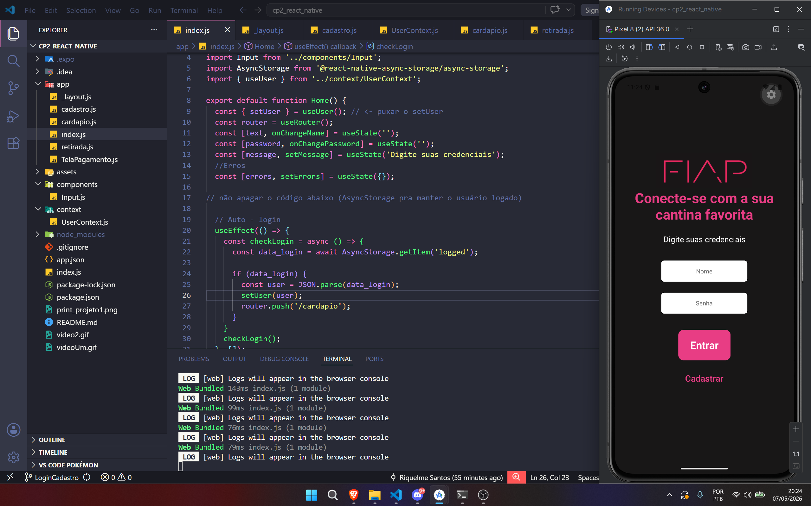
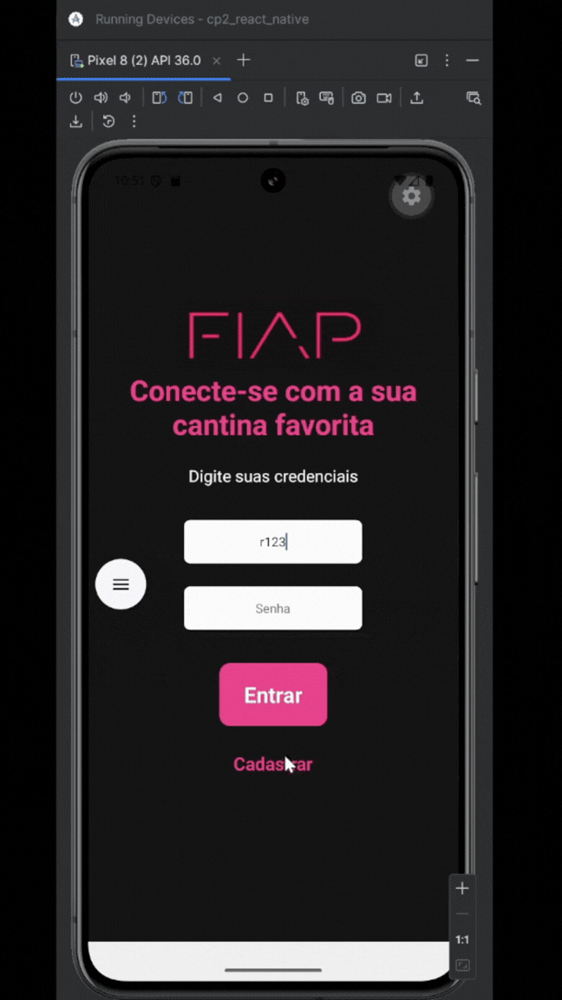
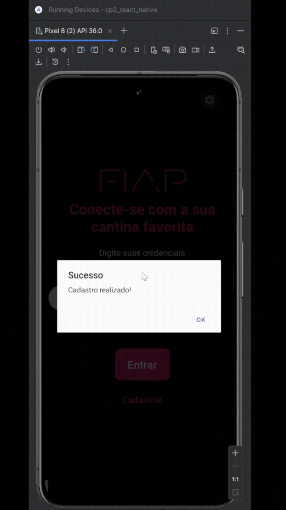
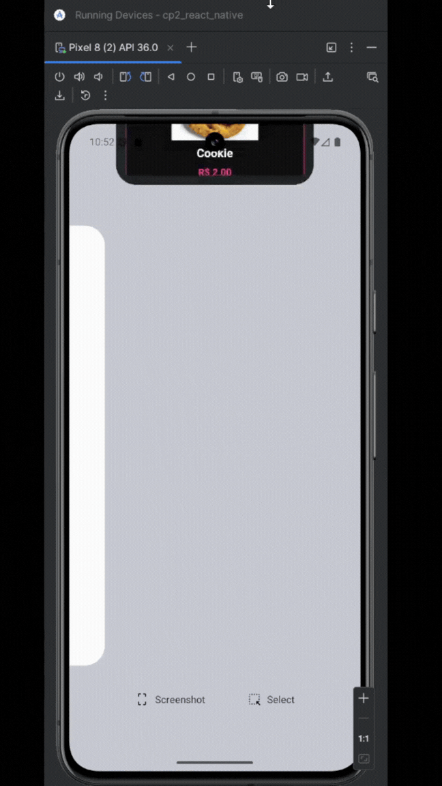

# CP 2 - REACT NATIVE 
Esse projeto é uma continuação da CP 1 de React native.
### Integrantes
Luiz Henrique Barbosa Dias | RM: 562399  
Riquelme Santos da Mata | RM: 565053  
Gregory Debom Ferreira |RM: 562346   
Nathan  Lopes Silva |RM: 563507  
Rodrigo Kenshin Viana Matayoshi | RM564026

## APP: FIAP CANTEEN 
Os alunos da Faculdade de Informática e Administração Paulista (FIAP) passam por um problema durante os intervalos das aulas: as grandes filas e incertezas na cantina. Esse obstáculo faz com que os estudantes fiquem ainda mais tempo nas filas e, muitas vezes, não possuem tempo o suficiente para comer ou descansar durante o intervalo. 

O aplicativo FIAP CANTEEN é um app MVP e foi criado com o objetivo e reduzir essas filas e incertezas, possibilitando aos estudantes a reserva e pré-pagamento dos lanches antes mesmo de chegar na cantina.

Para logar no aplicativo, é necessário colocar seu nome e senha, mas é importante criar um cadastro no app. Depois de cadastrar, seus dados ficarão salvos no app em um json e, depois de logar, o aplicativo irá exibir os lanches que estão disponíveis para compra na cantina da FIAP. Escolhendo o lanche e colocando as informações do cartão, seu lanche será comprado e um código será exibido para saber qual lanche foi comprado.

## Pré-requisitos
- Node.js : para baixar o Node.js, vá ao site oficial do Node.js, baixe o ambiente de execução Node.js e, após instalar, defina-o como variável de ambiente. 
Link do site: https://nodejs.org/pt-br.  
- EXPO GO: as instruções para configurar o EXPO estão no tópico **Como rodar o projeto**.

- Para baixar EXPO, abra a página do projeto edigite o código abaixo no terminal para ignorar conflitos de peer dependency:
```
npm install -g expo-cli
```
- Instalamos o expo e seus pacotes com o código abaixo:
```
npx expo install expo-router react-native-safe-area-context react-native-screens
```
- Finalmente, baixamos o AsyncStorage para permitir a persistência de dados. 
```
npx expo install @react-native-async-storage/async-storage
```

## Como clonar ou baixar o repositório
Para baixar o projeto, siga as orientações abaixo:
1. Clique no botão verde **code**;
2. Clique em **Download ZIP**;
3. Salve no seu computador.

Você também pode utilizar o comando **git clone** para clonar todo o repositório e ter acesso aos commits feitos durante o projeto. Para isso, basta fazer:
```
git clone https://github.com/Luizzzin/cp2_react_native.git
```
## Como rodar o projeto 
Para rodar o projeto, depois de instalar todas as dependências, o projeto já pode ser inicializado. Para isso, basta digitar o código abaixo no terminal:
```
npx expo start
```
A partir daqui, é possível visualizar o app de três formas: android studio, app expo no celular e via web.
Pelo android studio, que é configurado pelo EXPO (também é possível abrir o android studio manualmente, mas é necessário baixá-lo). Digite **a** no terminal para abrir o android studio, e o emulador irá começar a rodar.



Também é possível rodar o aplicativo no celular, basta baixar o app do EXPO GO no celular e depois apontar a câmera para o QRCODE gerado pelo EXPO no terminal. 

Finalmente, caso não tenha o app ou o android studio baixado, é possível abrir pelo navegador digitando W no terminal após a inicialização do expo. 

## Demonstração

VÍDEOS




obs: falta as telas depois da tela de cadastro

## Decisões técnicas
O aplicativo FIAP CANTEEN foi desenvolvido como um MVP (Minimum Viable Product), com foco em demonstrar a proposta de reduzir filas nas cantinas por meio de pedidos antecipados. Por ser um projeto apenas de front-end, as funcionalidades são simuladas, sem integração com backend.

Foi utilizado React Native com Expo para agilizar o desenvolvimento e testes, além do Android Studio como suporte para emulação no Android.

O hook useEffect foi utilizado para gerenciar estados e efeitos colaterais, como a definição e validação de dados do usuário (RM, senha) e exibição de mensagens de erro, simulando o processo de login.

A navegação do aplicativo foi organizada de forma linear e intuitiva, simulando a jornada do usuário dentro do sistema. O fluxo inicia na tela de Login, onde o usuário insere suas credenciais. Após a validação (simulada), o usuário é direcionado para o Menu de Lanches, onde pode visualizar e selecionar produtos. Em seguida, há a tela de Confirmação de Pagamento, que representa a finalização do pedido. Por fim, o usuário é direcionado para uma tela de Sucesso, onde é exibido um código do lanche para retirada, simulando o funcionamento real do sistema.

### Novas adições (obs: ajustar)
- como o projeto foi estruturado, quais contexts foram criadas 🆗, como a autenticação foi implementada, como asyncstorage foi implementado e quais dados foram persistidos e diferencial das aulas.  

```
CP2_REACT_NATIVE/ (AJUSTAR)
├── app/
│   ├── _layout.js
│   ├── index.js (login)
│   ├── cadastro.js
│   ├── cardapio.js
│   ├── retirada.js
│   └── TelaPagamento.js
├── assets/
├── components/
│   └── Input.js
├── context/
    └── UserContext.js
```
### UserContext
Foi utilizado a context **UserContext** para compartilhar o usuário logado entre todas as telas sem precisar ficar passando por parâmetro. No projeto, foi criado um UserProvider que envolve todas as telas no _layout.js, e dentro dele fica o user e o setUser. Na tela de login, ao autenticar, chama setUser(user) para salvar o usuário no contexto. No cardápio, usa useUser() para puxar o user e exibir o nome — user?.name.

### Autenticação 
No projeto, a autenticação é feita de forma manual comparando o que o usuário digitou com o que está salvo no AsyncStorage. No index.js, ao clicar em "Entrar", busca a lista de usuários na chave 'users' e usa .find() para verificar se existe alguém com aquele nome e senha. Se encontrar, salva na chave 'logged' e popula o contexto com setUser(user). Não há token, JWT ou autenticação externa — é tudo local.

### AsyncStorage
Já o **AsyncStorage** serve para persistir dados mesmo depois de fechar o app, funciona como um banco de dados local simples no celular. No projeto foi usado em três situações: salvar a lista de usuários cadastrados com a chave **users**, salvar o usuário logado com a chave **logged** para o auto-login funcionar, e remover a chave **logged** no logout para encerrar a sessão. A diferença pro UserContext é que o AsyncStorage sobrevive ao fechar o app, enquanto o contexto é apagado toda vez que o app reinicia — por isso os dois foram usados juntos.

### Navegação protegida
No projeto ela foi feita de duas formas. No index.js, o useEffect verifica ao abrir o app se já existe um usuário salvo no AsyncStorage — se sim, redireciona direto para o cardápio sem precisar logar de novo. No cardapio.js, o handlePress verifica se existe um usuário logado antes de ir para a tela de pagamento — se não existir, manda de volta para o login.

### Diferencial
modal

obs: ver as telas do luiz e do rodrigo

## O que o grupo faria se tivesse mais tempo
### Banco de dados e perfil de administrador
Hoje os produtos estão fixos no código e os dados ficam apenas no celular de cada usuário. Com um banco de dados como Firebase ou Supabase, tudo ficaria na nuvem — produtos, preços e pedidos — e qualquer mudança refletiria em tempo real para todos os usuários.  

Para o perfil de administrador, bastaria adicionar um campo role: 'admin' no cadastro. Ao logar, o app verificaria esse campo e redirecionaria para telas diferentes: o admin iria para um painel de gerenciamento onde poderia adicionar produtos e alterar preços, e o usuário comum seguiria para o cardápio normalmente. As duas funcionalidades andam juntas — o admin só faz sentido com um banco central, senão as alterações não chegam aos outros usuários.